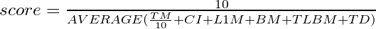

# Programa: 15-puzzle solver

## O que faz? Para que serve?
O programa escolhido é um solver ótimo para o 15-puzzle. Isto é, dado qualquer estado possível do 15-puzzle, o programa computa a solução que move o menor número de peças.
 
## Por que é bom para medir desempenho?
O 15-puzzle é um problema combinatório razovelmente difícil devido ao alto número de permutações possíveis. Assim sendo, a busca da solução ótima com o algoritmo A* 
explora uma árvore de busca de grande tamanho e pode ser utilizado como uma medida do desempenho do processador. Destaca-se que o programa utilizado não utiliza processamento paralelo, e portanto
o desempenho avaliado corresponde a um único core.

Também destacamos que a heurística utilizada pelo A*, chamada Pattern Databases, pré-computa as soluções para problemas menores, chamados patterns, e salva em um arquivo separado. 
Portanto, antes do solver iniciar a árvore de busca, ele carrega do disco para a RAM um arquivo que representa as soluções para os patterns. Na RAM esses patterns são salvos em uma tabela hash.
Esse arquivo possui cerca de 11.7MB, a inserção na tabela hash consome grande parte do tempo - e ele pode oferecer uma medida sobre a velocidade de leitura ao disco da máquina a ser analizada.

## O que baixar
O programa pode ser encontrado na pasta "programa" do seguinte repositório: https://github.com/henriquelalves/mc723benchmarking.git

## Como compilar/instalar
Um Makefile está disponível na pasta do programa, portanto, para compilar, basta que o usuário digite "make" no terminal.

## Como executar
Um script para rodar o programa também está disponível. Uma vez que o programa esteja compilado, para rodá-lo basta que o usuário digite "./run.sh" no terminal - isso irá gerar o arquivo de output com os dados e scores registrados.

## Como medir o desempenho

Através do profiler de Linux *perf*, o solver será rodado 5 vezes para se obter as médias dos seguintes atributos da máquina:
* Tempo médio de execução.
* Ciclos por Instruções (ciclo/instruções).
* Taxa de miss da memória cache L1 (cache-loads-misses/cache-loads).
* Taxa de erros na predição de branch (branch-misses/branch-instructions).
* Taxa de miss da TLB (TLB load misses / cache-references).
* Porcentagem de tempo de disco.

O erro de cada característica de execução é pré-computado pelo profiler para fins de análise final e validação dos resultados.

## Como apresentar o desempenho

O desempenho final da máquina após rodar o solver 5 vezes é gerado pelo profiler em um arquivo de output ("perf.out"); nele, o valor bruto das características é obtido, e combinados na planilha com o devido erro propagado quando necessário. O score final é calculado usando a seguinte equação:

A medição de tempo merece atenção especial pois foi decidido que ela seria a característica mais importante na determinação do score final; portanto, a medida foi dividida por 10 apenas para ter uma ordem de grandeza suficientemente grande para ser o grande diferencial na pontuação das máquinas testadas, sem perder a qualidade das outras características medidas.
 
## Medições base (uma máquina)
A máquina utilizada para as primeiras medições de Benchmarking possui a seguinte especificação de Hardware:

Processador | Cores | Cache | Disk Model
--- | --- | --- | ---
Intel® Core™ i5-4590 CPU @ 3.30GHz | 4 | L1: 32K, L2: 256K, L3: 6144K | HGST HTS721010A9E630

A medição inicial obtida foi:
Tempo de execução médio | Ciclos/Instrução | L1Misses/L1Loads | BranchMisses/BranchInstructions | TLBMisses / TLBLoads | % de Tempo de Disco | Score Final
--- | --- | --- | --- | --- | --- | ---
23.55 | 0.725199480453 | 0.0133852242446 | 0.0109411337384 | 0.470785594425 | 0.78 | 13.77628235
